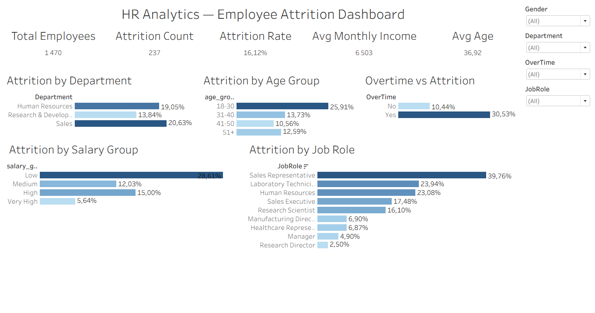

# HR Analytics — Employee Attrition Dashboard

A strategic HR analytics project analyzing employee attrition patterns across departments, roles, salary bands, and demographic groups — helping HR leadership identify high-risk segments and key drivers of turnover.

## Dashboard

🔗 **[View Live Dashboard on Tableau Public](https://public.tableau.com/views/HRAnalyticsEmployeeAttritionDashboard_17777372677390/HRAnalyticsEmployeeAttritionDashboard?:language=en-US&publish=yes&:sid=&:redirect=auth&:display_count=n&:origin=viz_share_link)**



---

## Objective

To help HR leadership identify the highest-risk employee segments and key drivers of attrition — providing a data-driven foundation for retention strategy and resource allocation.

---

## Tech Stack

| Tool | Usage |
|---|---|
| PostgreSQL | Data storage & querying |
| SQL (CTEs, Conditional Aggregation) | Attrition metrics calculation |
| Tableau Public | Interactive dashboard with cross-filters |

---

## Key Metrics

| Metric | Value |
|---|---|
| Total Employees | 1,470 |
| Employees Left | 237 |
| **Attrition Rate** | **16.12%** |
| Avg Monthly Income | $6,503 |
| Avg Age | 37 years |
| Avg Years at Company | 7 years |

> Industry benchmark for healthy attrition rate is 10-12%. TechCorp's 16.12% signals a retention problem worth addressing.

---

## Dashboard Visualizations

**1. Attrition by Department**
Sales (20.63%) and HR (19.05%) significantly exceed R&D (13.84%), suggesting role-specific burnout and compensation issues in customer-facing teams.

**2. Attrition by Age Group**
Employees aged 18-30 have a 25.91% attrition rate — nearly twice the rate of employees aged 41-50 (10.56%). Young talent retention is the biggest challenge.

**3. Overtime vs Attrition**
Employees working overtime have a 30.53% attrition rate vs 10.44% for those who don't. Overtime nearly **triples** the risk of leaving.

**4. Attrition by Salary Group**
Clear inverse relationship between salary and attrition:
- Low income (≤$3,000): **28.61%**
- Medium ($3,001–$7,000): 12.03%
- High ($7,001–$12,000): 15.00%
- Very High (>$12,000): **5.64%**

**5. Attrition by Job Role**
Sales Representatives have the highest attrition at **39.76%** — nearly 1 in 2 leaves. Research Directors are the most stable at 2.50%.

---

## Key Findings

- **Sales Representatives are the highest-risk group** — 39.76% attrition rate, meaning the company constantly recruits and trains new sales staff, driving up costs
- **Overtime is the strongest attrition driver** — employees working overtime are 3x more likely to leave regardless of department or salary
- **Low earners leave at 5x the rate of high earners** — compensation is a primary retention lever, especially for entry-level roles
- **Young employees (18-30) are hardest to retain** — 25.91% attrition suggests lack of career growth opportunities or competitive compensation for junior staff
- **R&D is the most stable department** — 13.84% attrition, likely due to specialized skills, higher compensation, and stronger engagement

---

## Business Recommendations

Based on the analysis, three priority actions for HR:

1. **Reduce overtime in Sales** — Sales + Overtime is the most toxic combination. Hiring additional headcount would cost less than constant replacement of burned-out reps.
2. **Review compensation for Low income band** — A targeted salary increase for the bottom band could significantly reduce the 28.61% attrition rate.
3. **Create career paths for 18-30 age group** — Structured mentorship, clear promotion criteria, and skill development programs to retain young talent.

---

## Data Source

**IBM HR Analytics Employee Attrition Dataset** — available on [Kaggle](https://www.kaggle.com/datasets/pavansubhasht/ibm-hr-analytics-attrition-dataset)

1,470 employees × 35 features including demographics, job characteristics, satisfaction scores, and attrition status.

Key fields used:

| Field | Description |
|---|---|
| `Attrition` | Whether employee left (Yes/No) |
| `Department` | Employee's department |
| `Age` | Employee age |
| `MonthlyIncome` | Monthly salary in USD |
| `JobRole` | Job title |
| `OverTime` | Whether employee works overtime |
| `JobSatisfaction` | Satisfaction score (1=Low, 4=High) |
| `YearsAtCompany` | Tenure in years |

---

## Key SQL & Tableau Techniques

**SQL:**
- **Conditional Aggregation** — `COUNT(CASE WHEN "Attrition" = 'Yes' THEN 1 END) / COUNT(*)` to calculate attrition rate within any segment in a single query
- **CTEs** — modular structure for age and salary group segmentation
- **CASE WHEN bucketing** — transforming continuous variables (Age, MonthlyIncome) into categorical groups for segment analysis

**Tableau:**
- **Calculated Fields** — `Attrition Rate` and `Attrition Count` computed dynamically in Tableau enabling cross-filter interactivity
- **Cross-dashboard filters** — single data source enables all 5 charts to respond simultaneously to Gender, Department, OverTime, and JobRole filters
- **Diverging color scale** — gradient from light to dark blue highlighting highest-risk segments at a glance

---

## Repository Structure

```
hr-attrition-dashboard/
│
├── README.md
└── HR Analytics.sql
```

---

## Author

**Danylo Demchuk**
[LinkedIn](https://linkedin.com/in/in/danylo-demchuk-da) · [Tableau Public](https://public.tableau.com/app/profile/.80735716/vizzes)
